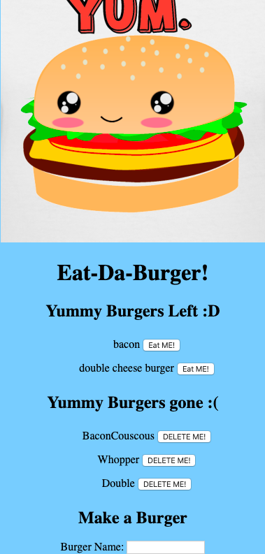

# Burgers

### Overview

This assignment is a simple burger logger with MySQL, Node, Express, Handlebars and a homemade ORM (yum!). 

### Application

You can check this application here:  https://safe-tor-20584.herokuapp.com/

### Installation 

npm install the following dependencies: 
* dotenv
* express
* express-handlebars
* mysql

